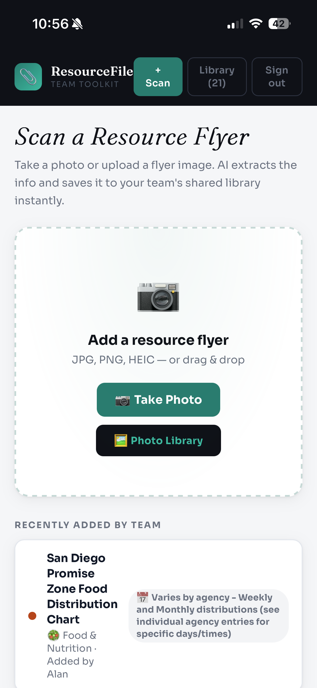
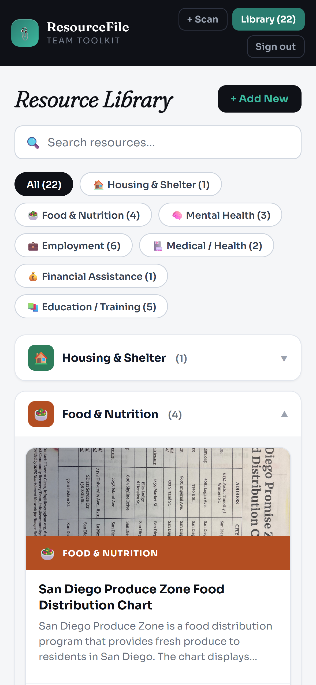
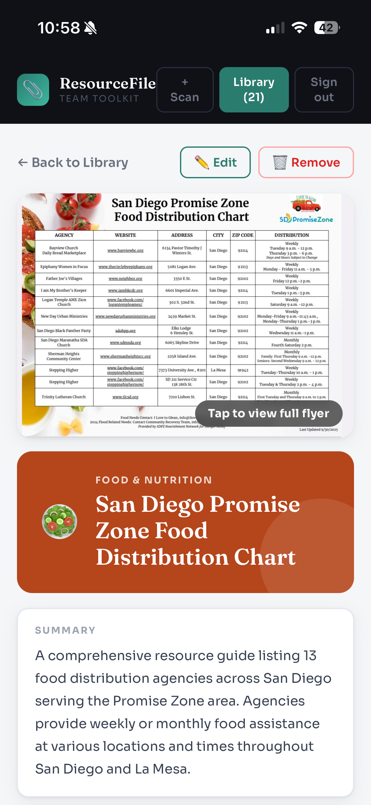
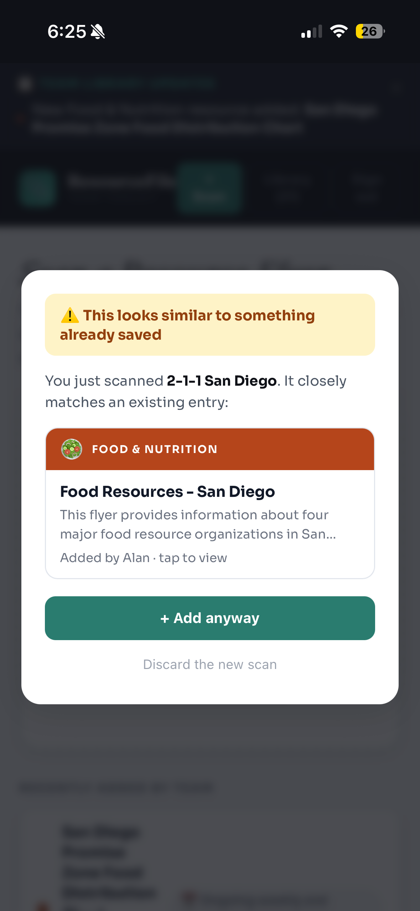
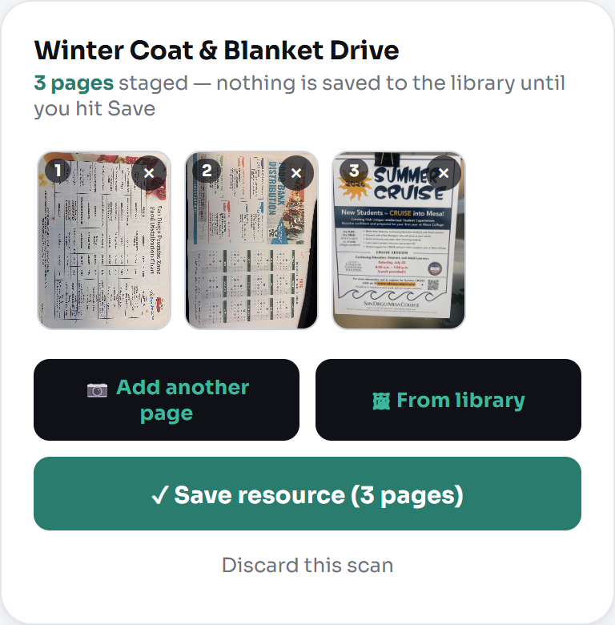
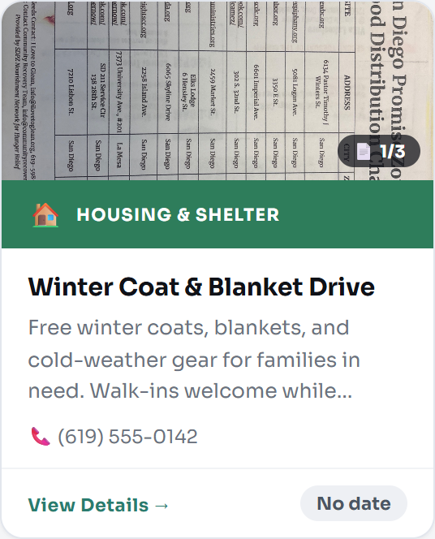
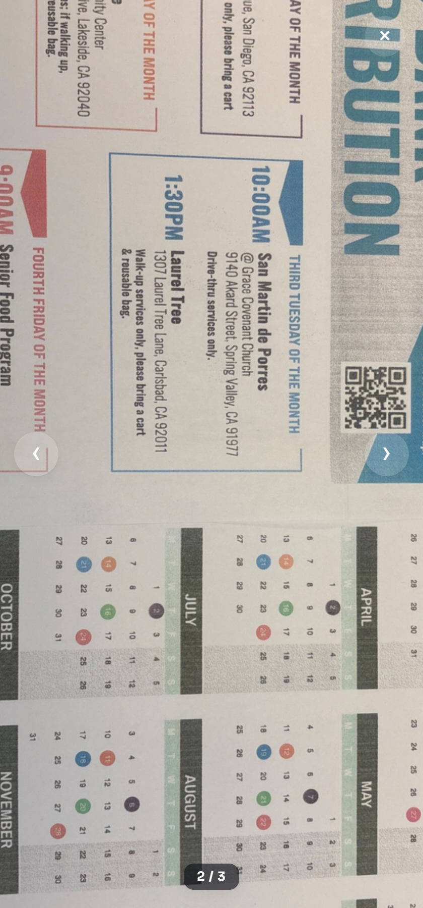

# ResourceFile - Team Toolkit

A web app that turns paper community resource flyers into a searchable, shared digital library. Built for a social services case management team.

**Live app:** [rezourcescanner.netlify.app](https://rezourcescanner.netlify.app)

## Problem

Case managers collect physical flyers for housing, food, mental health, and other community resources, but flyers get lost, go out of date, and aren't searchable. There was no shared way for staff to know what resources existed or whether they were still current.

## Solution

Staff scan a flyer with their phone camera. AI reads the flyer and pulls out the resource name, category, contact info, hours, eligibility requirements, and services offered, then saves it to a shared library the whole team can search and browse.

## Screenshots

**Scan a flyer**

Staff take a photo or upload an image. AI handles the data entry.

**Resource library**

Every saved resource is sorted into categories and searchable by the whole team.

**Resource detail**

Each entry includes the original flyer image alongside an AI-generated summary.

**Duplicate detection**

Before saving, the app checks for similar existing entries so the library stays clean.

**Staging tray for multi-page flyers**

Scanning no longer commits instantly. Staff can add every page of a multi-page flyer, remove a mis-scan, and review before anything is saved to the shared library.

**Multi-page library cards**

Resources with more than one page show a page-count badge right on the card.

**Zoom viewer**

Tap into any flyer image to pinch, scroll-wheel, or double-tap zoom and pan for fine print, with swipe navigation between pages.

## Key Features

- **Scan-to-save**: Point a phone camera at any flyer and AI handles the data entry
- **Multi-page flyers**: A staging tray lets staff add every page of a flyer, drop a mis-scan, and review before anything is saved; the edit screen supports the same add/remove/reorder controls after the fact
- **Zoom viewer**: Pinch, scroll-wheel, or double-tap to zoom into any flyer page for fine print, with swipe/arrow navigation across pages
- **Smart organization**: Resources are sorted into categories (housing, food, mental health, employment, legal, and more) with a searchable, collapsible library view
- **Duplicate detection**: Before saving, the app checks for similar existing entries and lets staff confirm, merge, or skip, so the library doesn't get cluttered
- **Smart expiration handling**: One-time events, recurring programs, and open-ended resources are each treated differently, so time-sensitive flyers age out automatically while ongoing programs stay listed
- **Edit anytime**: Any field can be corrected after scanning without having to rescan
- **Staff and public views**: Staff log in to add and manage resources, while a separate read-only view lets clients browse the library without an account
- **Mobile-first**: Built for quick use on a phone, with support for both photo library uploads and live camera capture

## Tech Stack

- Frontend: HTML, CSS, and JavaScript (single file, no frameworks)
- Backend: Supabase (database, authentication, file storage, serverless functions)
- AI: Anthropic Claude (vision model) for flyer data extraction
- Hosting: Netlify

## Why This Approach

The app was built as a single, self-contained file so it could be deployed and maintained without a local development environment. Drag, drop, done. That made it possible to iterate quickly and kept the deployment process simple enough for a small team to maintain long term.

## Status

Actively used by the team and expanding to a second team within the organization. Authentication and access controls are in place and locked down. Recent work added multi-page flyer support (staging tray, page-count badges, add/remove/reorder on the edit screen), a pinch/scroll/double-tap zoom viewer, multilingual flyer support so the app detects a flyer's language and keeps saved entries readable in that language, and closed a storage cleanup gap so images from deleted resources or discarded duplicate scans no longer pile up over time.
